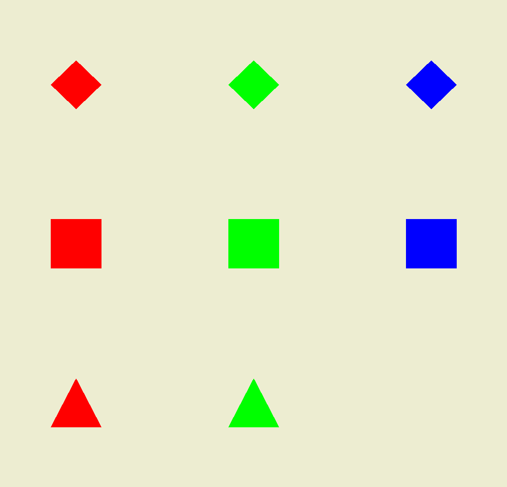

# Projet Taquin en OpenGL ES (Android)

Développé par Pierre-Louis Bertrand et Tom Ribardière

## Développement de l'application

Nous sommes partis du code de base donné en TD.

## Qu'est ce que ça donne ?

Lorsque le joueur démarre l'application, le plateau de jeu s'affiche avec les formes dans leur position initiale. 

Pour commencer la partie, le joueur doit appuyer une fois sur l'écran (n'importe où). Ainsi, le plateau se mélange et la partie commence. Une pop-up (Toast) s'affiche et indique ce qu'il s'est passé.

Maintenant, la partie a commencé. Pour jouer, le joueur doit appuyer sur les formes qu'il veut déplacer. Il n'est pas obligé de cliquer exactement sur la forme, il peut cliquer légèrement à côté. Deux cas peuvent se produire :

- Si le joueur clique sur une forme qui peut se déplacer (en haut, en bas, à gauche ou à droite de la case vide), la forme va donc se déplacer. (dans la capture d'écran, le joueur a cliqué sur le carré rouge, qui est donc monté car la case vide était au dessus)

- Par contre, dans le cas où le joueur clique sur une forme non adjacente à la case vide, le plateau va clignoter en orange, et une pop-up va indiquer que le déplacement de la forme en question est impossible actuellement.

Lorsque le joueur a réussi à réarranger les formes pour que la grille soit dans l'état initial, une pop-up va s'afficher avec un message de félicitations, invitant le joueur à rejouer, en cliquant n'importe où sur l'écran (même procédure pour commencer une nouvelle partie que lors du démarrage de l'application).

## Bugs connus

- Quand on clique plein de fois sur une case où le déplacement est impossible, les clignotements sont joués à la suite et l'application crashe au bout d'un moment
