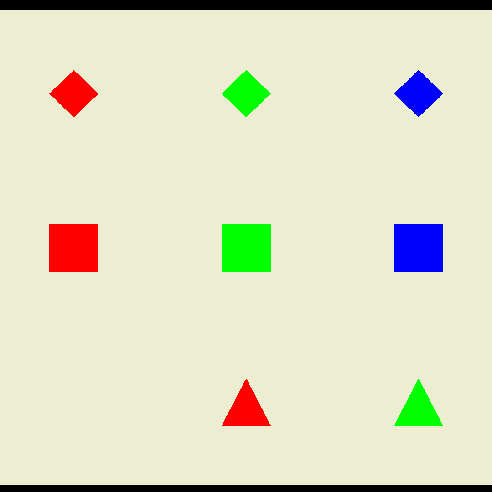

# Projet Taquin en OpenGL ES (Android)

Développé par Pierre-Louis Bertrand et Tom Ribardière sur le [répository git](https://github.com/tom2411/m1_prggraphique_opengles)

## Développement de l'application

Nous sommes partis du code de base donné en TD et nous avons fait pleins de tests pour vraiment obtenir un carré et non un ovale ou un rectangle.

Ensuite, nous avons commencé par faire quelques tests avec le code du carré que l'on nous avais donné. Puis nous avons commencé par la création des différentes formes que nous allions utiliser dans ce taquin. Nous avons fait des tests des différentes formes tel que les triangles ronds et autres. Cependant nous avons eu quelques problèmes avec le rond donc nous avons décidé de ne pas l'utiliser et de nous contenter des 3 formes que nous avions déjà qui étaient :
- le carré
- le triange 
- le losange

Par la suite nous nous sommes également basé sur le dessin du taquin qui nous était fourni avec le sujet pour faire un plateau en arrière plan du jeu.
Pour le faire nous avons juste repris le code du carré et fait des tests avec différentes tailles pour ce carré.

Une fois que nous avions toutes nos formes et que nous avions testé leurs affichages individuels. Nous avons essayé de réprésenter en "dur" dans le code une sorte de grille de forme pour tester le positionnement des différentes formes. Cependant, c'est à ce moment que l'on s'est rendus compte que l'on devait placer les formes en fonction des formes précédentes que nous avions déjà affichées.

Nous avons donc cherché un moyen qui nous permettait d'avoir le même repère pour toutes les formes et que le repère ne change pas. Au bout d'un certain temps, voici ce à quoi nous sommes convenu :

```java

float initSquareCoords[] = {
        -1.0f,   1.0f, 0.0f,
        -1.0f,  -1.0f, 0.0f,
        1.0f,  -1.0f, 0.0f,
        1.0f,  1.0f, 0.0f };
        2.
float squareCoords[] = {
        -1.0f,   1.0f, 0.0f,
        -1.0f,  -1.0f, 0.0f,
        1.0f,  -1.0f, 0.0f,
        1.0f,  1.0f, 0.0f };
        2.
public Square(float[] Pos, float red, float green, float blue) {
        this.Position[0] = Pos[0];
        this.Position[1] = Pos[1];
        for (int i = 0; i < squareCoords.length-1; i+=3) {
            squareCoords[i] = initSquareCoords[i] + this.Position[0];
            squareCoords[i+1] = initSquareCoords[i+1] + this.Position[1];
        }
```

Nous avons donc 2 variables qui sont déclarées et initialisées aux même valeurs, cependant nous avons le tableau `initSquareCoords` qui nous sert de tableau de référence et qui est centré sur le point de coordonnées (0,0). Nous avons ensuite, le tableau `squareCoords` qui nous sert à représenter les coordonnées actuelles  du carré. Dans le constructeur du carré nous créons un lien entre la position que nous mettons en paramètre du constructeur et les 2 tableaux, ce qui nous permet d'avoir des positions centrées par rapport à (0,0). Nous avons reproduit cette méthode sur toutes les formes que l'on utilise pour que le système de positionnement soit le plus homogène et simple possible.

Une fois ce promblème résolu nous avons pu facilement mettre en place un grille en "dur" avec toutes les formes qu'il nous fallait

Ensuite nous nous sommes penchés sur la structuration du code du jeu, c'est-à-dire du taquin. Nous avons parlés de plusieurs conceptions possibles et réalisables mais nous nous sommes accordés sur cette conception de grille.

```java
    private List<Forme> grille;
    private final int nbLignes;
    private final int nbColonnes;

    public Grille(int largeurGrille, int hauteurGrille, ArrayList<Forme> liste_formes) {
        this.nbLignes = hauteurGrille;
        this.nbColonnes = largeurGrille; // si on a toujours des grilles carrées, on pourrait retirer le paramètre hauteurGrille
        this.grille = liste_formes; // la liste des formes doit être de longueur de largeur * longueur
    }
```

Après avoir mis en place cette grille, il a fallu que nous mettions en place la synchronisation de la création de grille et le positionnement de chaque forme avec OpenGL. Ce fut mis en place assez rapidement et nous sommes donc passé aux déplacements possibles dans le jeu du taquin.

Nous avons commencé par la logique de ces differents déplacements, c'est-à-dire que nous avons commencé par coder les mouvements sans nous occuper de l'affichage.
D'ailleurs vous pouvez retrouver les différentes fonctions de déplacements que nous avons fait dans le fichier Grille.java.
Puis une fois les déplacements logiques mis en place nous sommes passé sur l'affichage de ces mouvements, ce qui n'a pas été de tout repos et qui nous a obligé à modifier quelque peu notre code.
Après quelques temps et quelques craquages, nous avons enfin réussi à afficher les déplacements du jeu en fonction des déplacements possibles.

Nous avions également besoin de créer une fonction qui nous permetterais de mélanger la grille avec des déplacements possibles aléatoires, pour que le jeu soit toujours solvable.

Nous avons choisi de ne faire qu'un mélange de 9 déplacements pour que l'on puisse tester toutes les fonctionnalités que nous étions en train de développer.
Ce nombre de déplacement àléatoire se trouve dans le SurfaceView et peut être modifier à votre guise.

```java
else if (!this.mRenderer.getGame().isMelange()){
    // si on touche l'écran
    if (e.getAction() == MotionEvent.ACTION_UP){
        Log.d("Avant mélange", ""+mRenderer.getGame().mGrille().getGrille());
        // on fait des déplacements possible x fois
        mRenderer.getGame().mGrille().melangerGrille(9);
        Log.d("Après mélange", ""+mRenderer.getGame().mGrille().getGrille());
        this.mRenderer.getGame().setMelange(true); // on met à jour le boolean de mélange
        Toast.makeText(getContext(), "La grille est mélangée, bon courage !", Toast.LENGTH_SHORT).show();
        requestRender();// on met à jour l'affichage
    }
}
```

Il ne nous restait plus que de pouvoir savoir si l'on avait fini le jeu, et de donner des informations au joueur sur les déplacements possibles ou impossibles et sur l'avancement de la partie.

Pour l'état final de la partie, nous avons gardé en mémoire une grille non mélangée et nous testons à chaque déplacement si la grille est égale à la grille finale.
Pour ce qui est des informations que l'on doit fournir à l'utilisateur, nous nous sommes contentés de mettre des toasts pour l'avertir de l'avancement du jeu et nous avons créer une fonction qui nous permet de faire clignoter notre plateau pour lui indiquer qu'un coup n'est pas valide et donc ne peut pas être joué. 

## Bonus

Nous avons décider de rajouter des sons quand certaines actions étaient déclanchées comme par exemple la victoire d'une partie ou juste le déplacement d'une forme. Nous nous sommes servis de ce que Android Studio nous fournissait de base, c'est-à-dire du MediaPlayer. Voici un aperçu de notre code.

```java
MediaPlayer media = MediaPlayer.create(getContext(), R.raw.caught_a_pokemon);
media.start();
```

## Qu'est ce que ça donne ?

Lorsque le joueur démarre l'application, le plateau de jeu s'affiche avec les formes dans leur position initiale. 


Pour commencer la partie, le joueur doit appuyer une fois sur l'écran (n'importe où). Ainsi, le plateau se mélange et la partie commence. Une pop-up (Toast) s'affiche et indique ce qu'il s'est passé.


Maintenant, la partie a commencé. Pour jouer, le joueur doit appuyer sur les formes qu'il veut déplacer. Il n'est pas obligé de cliquer exactement sur la forme, il peut cliquer légèrement à côté. Deux cas peuvent se produire :

- Si le joueur clique sur une forme qui peut se déplacer (en haut, en bas, à gauche ou à droite de la case vide), la forme va donc se déplacer. (dans la capture d'écran, le joueur a cliqué sur le carré rouge, qui est donc monté car la case vide était au dessus)



- Par contre, dans le cas où le joueur clique sur une forme non adjacente à la case vide, le plateau va clignoter en orange, et une pop-up va indiquer que le déplacement de la forme en question est impossible actuellement.


Lorsque le joueur a réussi à réarranger les formes pour que la grille soit dans l'état initial, une pop-up va s'afficher avec un message de félicitations, invitant le joueur à rejouer, en cliquant n'importe où sur l'écran (même procédure pour commencer une nouvelle partie que lors du démarrage de l'application).


## Bugs connus

- Quand on clique plein de fois sur une case où le déplacement est impossible, les clignotements sont joués à la suite et l'application crashe au bout d'un moment
- Pour les différents sons, nous avons un problème qui est que plusieurs clips audios puissent se jouer en même temps se qui cause un léger brouhaha. De plus de temps en temps les clips ne se jouent pas mais nous savons pas pourquoi.
